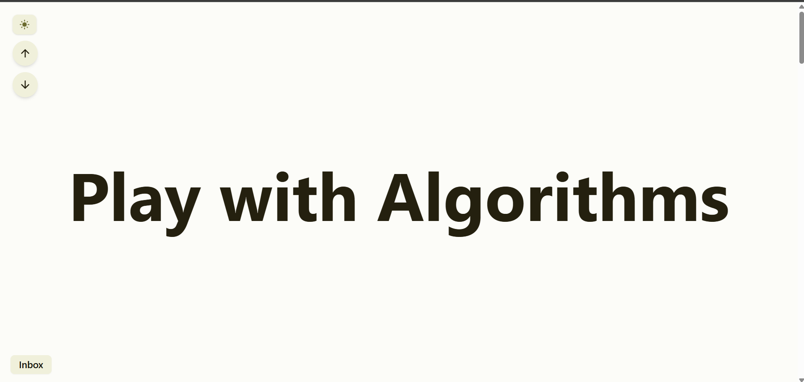
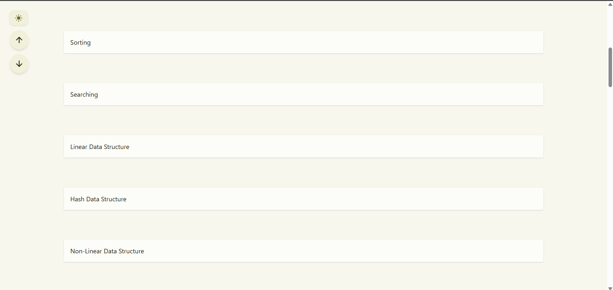
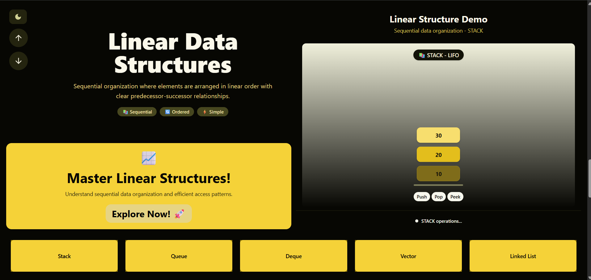
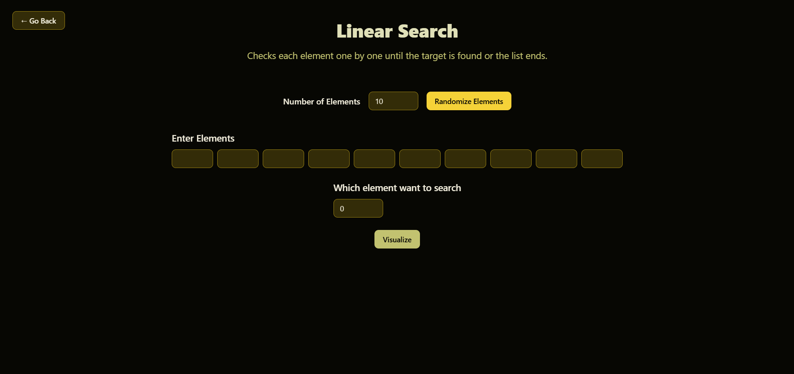

# 🎯 PlayWithAlgorithms

An interactive **algorithm visualization platform** built with **Next.js, TypeScript, and Shadcn UI**.  
It helps learners understand complex **searching, sorting, and data structures** through **step-by-step visualizations and animations**.

 
 
 


---

## 🚀 Live Demo
👉 [PlayWithAlgorithms on Vercel](https://playwithalgorithms.vercel.app)

---

## 📌 Features
- **Searching Algorithms**: Binary Search, Linear Search  
- **Sorting Algorithms**: Merge, Quick, Bubble, Counting, Radix, Heap, Selection, Insertion  
- **Linear Data Structures**: Stack, Queue, Deque, Linked List, Vector  
- **Hash-Based Structures**: HashMap, HashSet, UnorderedMap, UnorderedSet  
- **Non-Linear Structures**: Binary Tree, Binary Search Tree (BST)  
- **Step-by-Step Animations**: Visualize how algorithms and data structures work internally  
- **Modern UI**: Responsive, clean, and interactive design with Shadcn UI  

---

## 🛠️ Tech Stack
- **Frontend**: Next.js, TypeScript, Shadcn UI  
- **Styling**: Tailwind CSS  
- **Deployment**: Vercel  

---

## 📷 Screenshots
Example:  









---

## 🏗️ Installation & Setup
Clone the repository and run it locally:

```bash
# Clone the repo
git clone https://github.com/SARVESHYOGI/playwithalgorithms.git

# Navigate to project directory
cd playwithalgorithms

# Install dependencies
npm install

# Start development server
npm run dev
